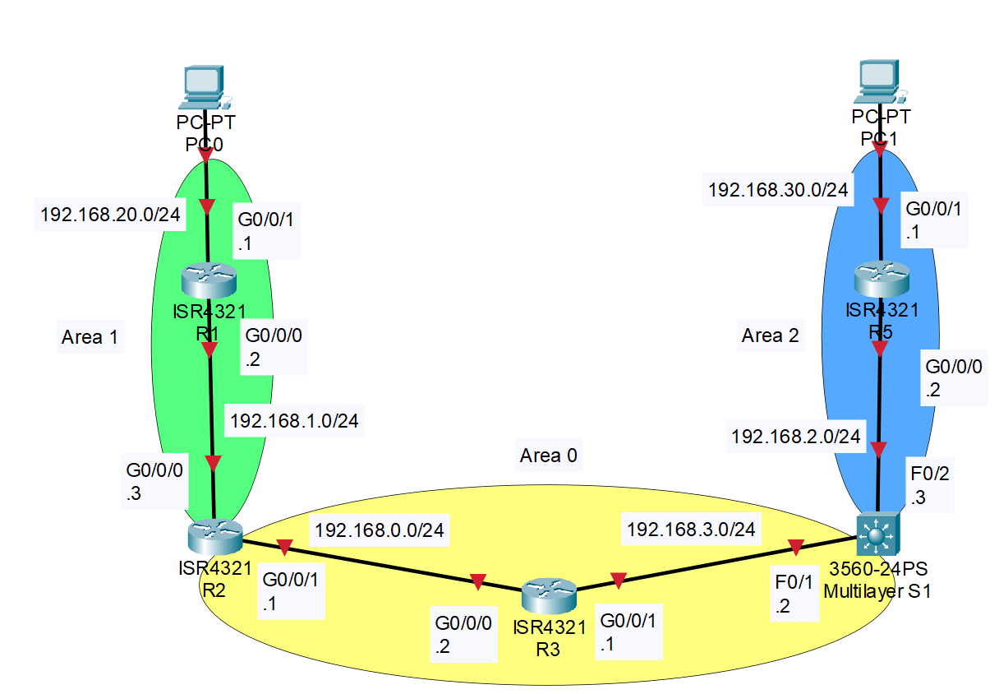
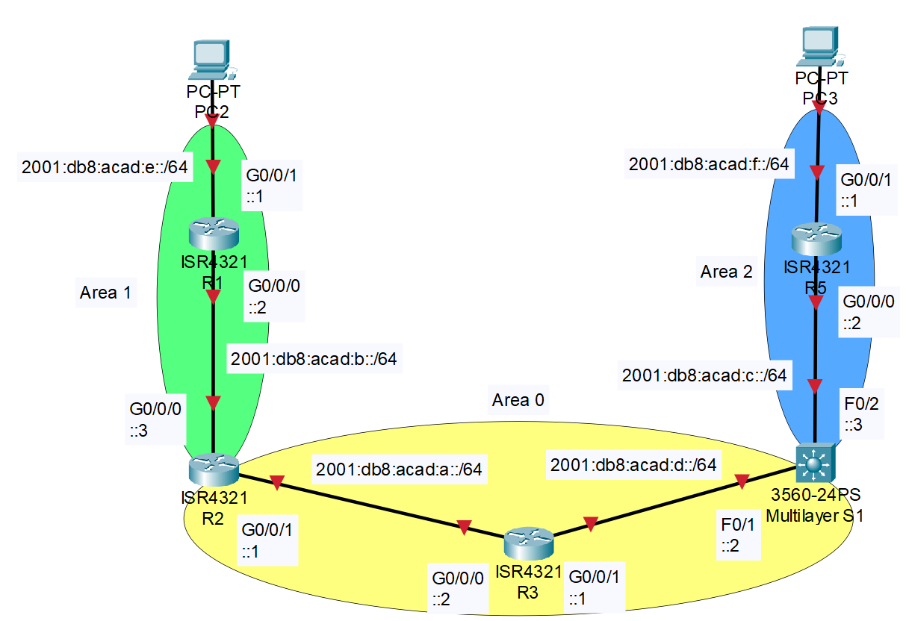

# Multiarea OSPF Configuration with IPv4 & IPv6

## Contents

- [**Purpose**](#purpose)
- [**Lab Summary**](#lab-summary)
- [**Topology**](#topology)
  - [**IPv4 Topology**](#ipv4-topology)
  - [**IPv6 Topology**](#ipv6-topology)
- [**Address Table**](#address-table)
- [**Device Overview**](#device-overview)
- [**ICMPv4 Ping Across Network**](#icmpv4-ping-across-network)
- [**ICMPv6 Ping Across Network**](#icmpv6-ping-across-network)
- [**IPv4 Routing Table**](#ipv4-topology)
- [**IPv6 Routing Table**](#ipv6-topology)
- [**Copyright**](#copyright)

## Purpose

This lab's purpose is to create a multi-area Open Shortest Path First (OSPF) routing process with at least 3 areas, 2 routers in each area, and one layer 3 switch between 2 areas. For this lab, one needs to understand how to create subnets for networks, advertise interfaces for OSPF, and connect links between devices. One also needs to learn how to write network statements, using wildcard masks.

## Lab Summary

In this lab, a multi-area OSPF network with 3 areas was set up. 5 network devices were included in this network: four 4321 routers and one 3560 multilayer switch. The goal of this lab was for OSPF to supply routes for the IPv6 and IPv4 networks, which would ultimately allow the host devices to communicate with each other.

## Topology

These are the topologies for both IPv4 and IPv6, each link is labeled with the network number and subnet mask of the link. Then each interface is labeled with the 4th octet of the usable IP address within the subnet of that link.\
Additionally, the PCs can have any IP that is within the subnet of the link that they are on. **DHCP is not setup**.

### IPv4 Topology



### IPv6 Topology



## Address Table

|Device Name|Interface|IPv6 Address          |IPv4 Address|IPv4 Subnet Mask|
|:----------|:--------|:---------------------|:-----------|:--------------:|
|R1         |G0/0/0   |2001:db8:acad:b::2/64 |192.168.1.2 |255.255.255.0   |
|R1         |G0/0/1   |2001:db8:acad:e::1/64 |192.168.20.1|255.255.255.0   |
|R2         |G0/0/0   |2001:db8:acad:b::3/64 |192.168.1.3 |255.255.255.0   |
|R2         |G0/0/1   |2001:db8:acad:a::1/64 |192.168.0.1 |255.255.255.0   |
|R3         |G0/0/0   |2001:db8:acad:a::2/64 |192.168.0.2 |255.255.255.0   |
|R3         |G0/0/1   |2001:db8:acad:d::1/64 |192.168.3.1 |255.255.255.0   |
|R5         |G0/0/0   |2001:db8:acad:c::2/64 |192.168.2.2 |255.255.255.0   |
|R5         |G0/0/1   |2001:db8:acad:f::10/64|192.168.30.1|255.255.255.0   |
|S1         |F0/1     |2001:db8:acad:d::2/64 |192.168.3.2 |255.255.255.0   |
|S1         |F0/2     |2001:db8:acad:c::3/64 |192.168.2.3 |255.255.255.0   |

## Device Overview

This Topology Consists of...

- Five 4321 routers running Cisco IOS XE Software, Version 16.9 Universal K9
- One Cisco 3560 POE-38 running C3560-IPSERVICESK9-M Version 12.2(44)SE5

## ICMPv4 Ping Across Network

```text
C:\>ping 192.168.30.10

Pinging 192.168.30.10 with 32 bytes of data:

Reply from 192.168.30.10: bytes=32 time<1ms TTL=255
Reply from 192.168.30.10: bytes=32 time<1ms TTL=255
Reply from 192.168.30.10: bytes=32 time<1ms TTL=255
Reply from 192.168.30.10: bytes=32 time<1ms TTL=255

Ping statistics for 192.168.30.10:
    Packets: Sent = 4, Received = 4, Lost = 0 (0% loss),
Approximate round trip times in milli-seconds:
    Minimum = 0ms, Maximum = 0ms, Average = 0ms
```

## ICMPv6 Ping Across Network

```text
C:\>ping 2001:db8:acad:f::10

Pinging 2001:db8:acad:f::10 with 32 bytes of data:

Reply from 2001:DB8:ACAD:F::10: bytes=32 time<1ms TTL=255
Reply from 2001:DB8:ACAD:F::10: bytes=32 time<1ms TTL=255
Reply from 2001:DB8:ACAD:F::10: bytes=32 time<1ms TTL=255
Reply from 2001:DB8:ACAD:F::10: bytes=32 time<1ms TTL=255

Ping statistics for 2001:DB8:ACAD:F::10:
    Packets: Sent = 4, Received = 4, Lost = 0 (0% loss),
Approximate round trip times in milli-seconds:
    Minimum = 0ms, Maximum = 0ms, Average = 0ms
```

## R1 IPv4 Routing Table

```text
R1#show ip route
Codes: L - local, C - connected, S - static, R - RIP, M - mobile, B - BGP
       D - EIGRP, EX - EIGRP external, O - OSPF, IA - OSPF inter area
       N1 - OSPF NSSA external type 1, N2 - OSPF NSSA external type 2
       E1 - OSPF external type 1, E2 - OSPF external type 2
       i - IS-IS, su - IS-IS summary, L1 - IS-IS level-1, L2 - IS-IS level-2
       ia - IS-IS inter area, * - candidate default, U - per-user static route
       o - ODR, P - periodic downloaded static route, H - NHRP, l - LISP
       a - application route
       + - replicated route, % - next hop override, p - overrides from PfR

Gateway of last resort is not set

O IA  192.168.0.0/24 [110/2] via 192.168.1.3, 00:03:22, GigabitEthernet0/0/0
      192.168.1.0/24 is variably subnetted, 2 subnets, 2 masks
C        192.168.1.0/24 is directly connected, GigabitEthernet0/0/0
L        192.168.1.2/32 is directly connected, GigabitEthernet0/0/0
O IA  192.168.2.0/24 [110/4] via 192.168.1.3, 00:03:10, GigabitEthernet0/0/0
O IA  192.168.3.0/24 [110/3] via 192.168.1.3, 00:03:22, GigabitEthernet0/0/0
      192.168.20.0/24 is variably subnetted, 2 subnets, 2 masks
C        192.168.20.0/24 is directly connected, GigabitEthernet0/0/1
L        192.168.20.1/32 is directly connected, GigabitEthernet0/0/1
O IA  192.168.30.0/24 [110/5] via 192.168.1.3, 00:03:10, GigabitEthernet0/0/0
```

## R1 IPv6 Routing Table

```text
R1#show ipv6 route
IPv6 Routing Table - default - 9 entries
Codes: C - Connected, L - Local, S - Static, U - Per-user Static route
       B - BGP, R - RIP, I1 - ISIS L1, I2 - ISIS L2
       IA - ISIS interarea, IS - ISIS summary, D - EIGRP, EX - EIGRP external
       ND - ND Default, NDp - ND Prefix, DCE - Destination, NDr - Redirect
       O - OSPF Intra, OI - OSPF Inter, OE1 - OSPF ext 1, OE2 - OSPF ext 2
       ON1 - OSPF NSSA ext 1, ON2 - OSPF NSSA ext 2, a - Application
OI  2001:DB8:ACAD:A::/64 [110/2]
     via FE80::CE7F:76FF:FE6A:B5E0, GigabitEthernet0/0/0
C   2001:DB8:ACAD:B::/64 [0/0]
     via GigabitEthernet0/0/0, directly connected
L   2001:DB8:ACAD:B::2/128 [0/0]
     via GigabitEthernet0/0/0, receive
OI  2001:DB8:ACAD:C::/64 [110/4]
     via FE80::CE7F:76FF:FE6A:B5E0, GigabitEthernet0/0/0
OI  2001:DB8:ACAD:D::/64 [110/3]
     via FE80::CE7F:76FF:FE6A:B5E0, GigabitEthernet0/0/0
C   2001:DB8:ACAD:E::/64 [0/0]
     via GigabitEthernet0/0/1, directly connected
L   2001:DB8:ACAD:E::1/128 [0/0]
     via GigabitEthernet0/0/1, receive
OI  2001:DB8:ACAD:F::/64 [110/5]
     via FE80::CE7F:76FF:FE6A:B5E0, GigabitEthernet0/0/0
L   FF00::/8 [0/0]
     via Null0, receive
```

## Copyright

MIT License

Copyright (c) 2026 101zh

Permission is hereby granted, free of charge, to any person obtaining a copy of this software and associated documentation files (the "Software"), to deal in the Software without restriction, including without limitation the rights to use, copy, modify, merge, publish, distribute, sublicense, and/or sell copies of the Software, and to permit persons to whom the Software is furnished to do so, subject to the following conditions:

The above copyright notice and this permission notice shall be included in all copies or substantial portions of the Software.

THE SOFTWARE IS PROVIDED "AS IS", WITHOUT WARRANTY OF ANY KIND, EXPRESS OR IMPLIED, INCLUDING BUT NOT LIMITED TO THE WARRANTIES OF MERCHANTABILITY, FITNESS FOR A PARTICULAR PURPOSE AND NONINFRINGEMENT. IN NO EVENT SHALL THE AUTHORS OR COPYRIGHT HOLDERS BE LIABLE FOR ANY CLAIM, DAMAGES OR OTHER LIABILITY, WHETHER IN AN ACTION OF CONTRACT, TORT OR OTHERWISE, ARISING FROM, OUT OF OR IN CONNECTION WITH THE SOFTWARE OR THE USE OR OTHER DEALINGS IN THE SOFTWARE.
